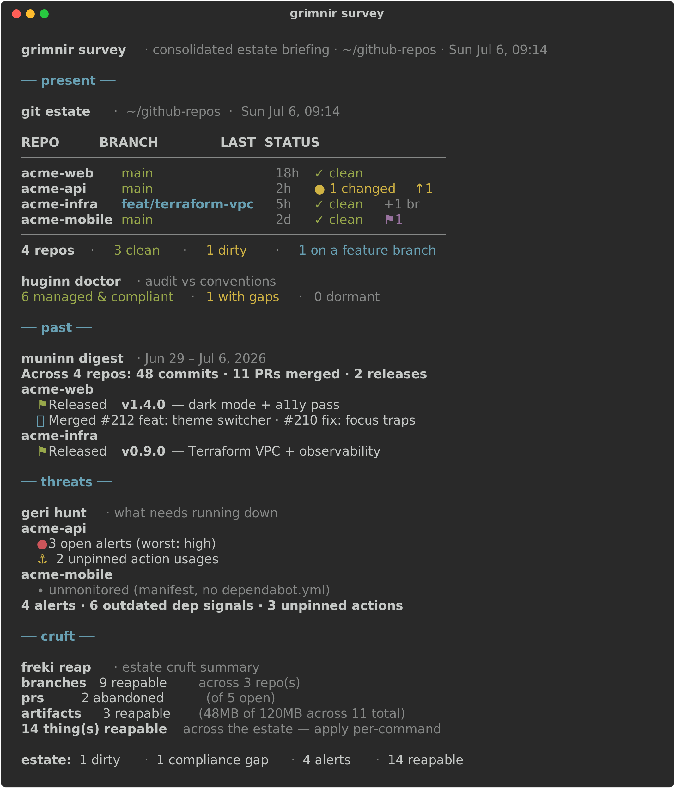

# grimnir

The Allfather's high seat — one command center over the four beasts that run a personal GitHub
**estate**. Odin's byname ("the masked one"), from Hliðskjálf, sees into all realms at once and
commands the ravens and wolves. `grimnir` is that seat.

| Beast | Myth | Does |
|---|---|---|
| [huginn](https://github.com/brett-buskirk/huginn) | raven — thought | present state + convention compliance |
| [muninn](https://github.com/brett-buskirk/muninn) | raven — memory | history: what shipped, and when |
| [geri](https://github.com/brett-buskirk/geri) | wolf — hunter | threats: security alerts, stale deps, drift |
| [freki](https://github.com/brett-buskirk/freki) | wolf — reaper | cruft: stale branches, dead PRs, old artifacts |

grimnir's value is consolidation, not aliasing — every command marshals two or more beasts (or
governs the pack itself) into a view none of them can produce alone.

<p align="center">
  
</p>

> **Note:** config-driven like the rest of the pack — falls back to huginn's config (owner, root)
> when its own is unset, so a huginn user gets a working grimnir with zero setup. See the
> [Roadmap](ROADMAP.md) for what's next.

## Install

Requirements: `bash`, `git`, [`gh`](https://cli.github.com) (authenticated), `jq` — plus whichever
of `huginn`/`muninn`/`geri`/`freki` you want surveyed (grimnir degrades gracefully if one's missing).

```bash
git clone git@github.com:brett-buskirk/grimnir.git ~/github-repos/grimnir
ln -s ~/github-repos/grimnir/grimnir ~/.local/bin/grimnir   # ~/.local/bin must be on your PATH
```

Then let grimnir bring down and wire up the rest of the pack for you:

```bash
grimnir rally      # clone the four beasts + symlink them into ~/.local/bin
```

`rally` is the one-command onboarding: install grimnir, run `grimnir rally`, and the whole suite
(huginn/muninn/geri/freki) is cloned from `brett-buskirk` and ready. It's idempotent — a beast
already present is left untouched; `rally --update` pulls the pack to latest.

## Commands

```
survey the estate
  survey                 one consolidated briefing — present · past · threats · cruft
  brief                  the deltas since your last brief — a lean morning digest
provision
  rally [--update]       assemble the pack — clone the four beasts + wire them up
  install [--force]      symlink the present beasts into ~/.local/bin
  summon [--agent]       clone every repo you own into the estate (--agent seats an operator)
configure
  config [set|edit]      the shared estate config — owner · root · exemptions
  schedule [install]     cron a daily brief to a logfile (+ opt-in digest / hunt)
inspect the pack
  doctor                 pack health — installed · on PATH · linked · current
  version                every beast's version, at a glance
reference
  help                   this menu
```

Run **`grimnir <command> help`** for details and options on any command. For a one-page reference to
every command, option, and behavior, see the [**cheat sheet**](CHEATSHEET.md).

## How it works

- **`survey`** runs each installed beast's heaviest summary command — `huginn status` + `huginn
  doctor`, `muninn digest --since 1w`, `geri hunt`, `freki reap` — under a labeled section, then
  synthesizes a top-line `estate:` headline (dirty repos, compliance gaps, open alerts, reapable
  cruft) from their own output. A beast missing from `PATH` is skipped with a quiet note rather than
  failing the whole survey.
- **`brief`** (alias `morning`) is the stateful counterpart — not the whole estate, just what
  *changed* since you last looked. It diffs geri's alerts/deps/actions and freki's reapable count
  against a saved snapshot (`▲` up / `▼` down), shows `muninn digest` for the window since your last
  brief, and headlines what's new (`all quiet` when nothing moved). First run saves a baseline;
  `--no-save` peeks without advancing it. State lives in
  `${XDG_STATE_HOME:-~/.local/state}/grimnir/brief-state` — built to run each morning from cron.
- **`summon`** gathers the realms — `gh repo list` every repo you own, clone the ones missing from
  `$GRIMNIR_ROOT`, and (with `--update`) fast-forward the ones already there (skipping any with
  uncommitted changes). Cloning is additive, so there's no `--apply` gate; updating is opt-in so a
  summon never disturbs unpushed work. Exemptions govern *management*, not *presence* — summon brings
  down everything you own, even repos the ravens/wolves skip when acting.
  - **`summon --agent`** seats an operator in the high seat: after summoning, it writes an estate-root
    `AGENTS.md` — an agent-agnostic steward briefing personalized to your owner, root, and *installed*
    beasts — plus a one-line `CLAUDE.md` (`@AGENTS.md`) so Claude Code picks it up too. Open an agent
    session at the estate root and it already knows the lay of the land. Idempotent: an existing
    `AGENTS.md` is never clobbered without `--force`. Template: bundled `templates/AGENTS.md`,
    overridable at `<conventions>/templates/AGENTS.md`. `--agent=agents|claude|both` (default `both`).
- **`rally`** assembles the pack — clones any of the four beasts missing from `$GRIMNIR_ROOT` (from
  `$GRIMNIR_PACK_OWNER`, default `brett-buskirk`), then runs the same wiring `install` does. Idempotent
  by default (present beasts are left alone); `--update` fast-forwards them, `--force` repairs a
  symlink pointing elsewhere.
- **`install`** is the local half of provisioning — symlinks each beast script already present in the
  estate into `$GRIMNIR_BIN` (default `~/.local/bin`), checks deps, and scaffolds grimnir's config.
  Idempotent; `rally` builds on it by fetching what's missing first.
- **`config`** is one front-end for the shared estate identity every beast reads — `config show`
  resolves owner, root, exemptions, and which beast configs exist; `config init` / `set` / `edit`
  manage grimnir's own config file. Any key left unset falls back to huginn's config, so you set the
  estate identity once and the whole pack follows.
- **`doctor`** / **`version`** inspect the pack *itself* (distinct from `huginn doctor`, which audits
  your repos). `version` shows each member's version, derived from its latest git tag; `doctor` reports
  deps, `gh` auth, config, `$PATH`, and per-beast whether it's in the estate, on `PATH`, and linked
  back to the estate — flagging a stray symlink (repair with `install --force`) or a missing beast
  (fetch with `rally`).
- **`schedule`** crons the routines so they run on their own — by default a daily `grimnir brief`
  whose output appends to a logfile under `${XDG_STATE_HOME:-~/.local/state}/grimnir/` (cron has no
  terminal). It manages only its own delimited block in your crontab — your other cron jobs are never
  touched — and `--weekly-digest` / `--daily-hunt` add those routines too.
- **Graceful degradation is the whole design** — grimnir is useful with only one beast installed,
  and gets more useful as you add the rest.
- **Respects `NO_COLOR`** and non-TTY output.

## Configuration

Settings resolve **environment variable → config file → huginn's config → smart default**. Config
file: `${XDG_CONFIG_HOME:-~/.config}/grimnir/config` (override with `GRIMNIR_CONFIG`).

| Key / env var | Default | Purpose |
|---|---|---|
| `GRIMNIR_OWNER` | `HUGINN_OWNER`, else your `gh` login | GitHub owner of the estate repos |
| `GRIMNIR_ROOT` | `HUGINN_ROOT`, else `~/github-repos` | directory of repos to manage |
| `GRIMNIR_BIN` | `~/.local/bin` | where `install` / `rally` symlink the beasts |
| `GRIMNIR_PACK_OWNER` | `brett-buskirk` | canonical source `rally` clones the beasts from |
| `GRIMNIR_CONVENTIONS` | `repo-conventions` | dir under the root with `exemptions.json` |

grimnir doesn't need its own config to be useful — if `~/.config/huginn/config` exists, it's used
automatically. `NO_COLOR` and non-TTY output are respected everywhere.

## Roadmap

survey · brief · summon (+ `--agent`) · rally · install · config · schedule · doctor · version are
all shipped; the phased build-out and what's left (the v1.0.0 release) is tracked in
[ROADMAP.md](ROADMAP.md).

## License

[MIT](LICENSE) © 2026 Brett Buskirk
